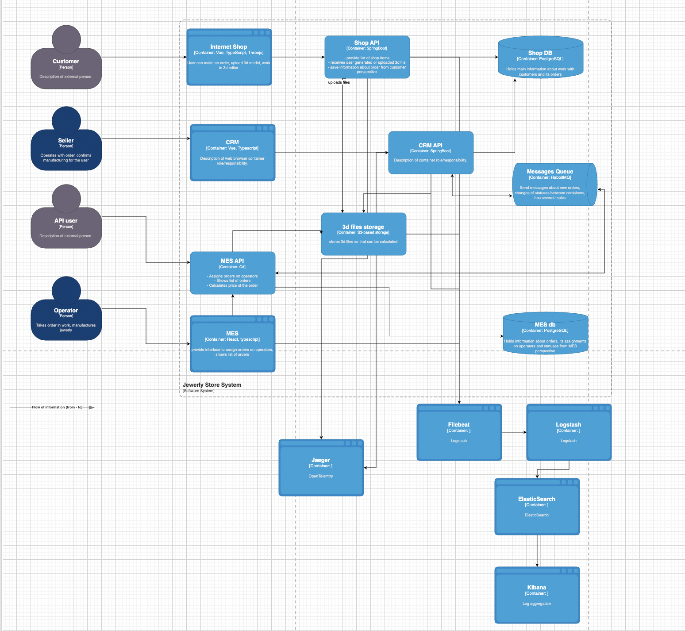

### Сейчас большинство инцидентов разбирается со слов клиента, что:

1) создаёт высокую нагрузку на поддержку

2) не позволяет точно определить источник проблемы

3) затрудняет устранение причин ошибок

### Внедрение логирования даст:

1) хронологию событий внутри каждого сервиса

2) возможность восстанавливать цепочку без трейсинга

3) ускорение диагностики ошибок и отклонений

4) прозрачность бизнес-процессов

5) MTTR (mean time to resolve) сократится.

6) Количество обращений в поддержку снизится.

7) Будет легче выявлять причины SLA-фейлов.

8) Возможно автоматическое оповещение об аномалиях.

### Что логировать (уровень INFO)

| Сервис     | Событие                        | Поля                                                        |
|------------|-------------------------------|-------------------------------------------------------------|
| Магазин    | SUBMITTED                     | order_id, user_id, timestamp                                |
| Магазин    | FILE_UPLOADED                 | file_name, file_size, model_complexity                      |
| MES        | PRICE_CALCULATED              | order_id, duration_ms, model_complexity                     |
| CRM        | MANUFACTURING_APPROVED        | order_id, approved_by, timestamp                            |
| MES        | MANUFACTURING_STARTED         | order_id, operator_id, timestamp                            |
| MES        | MANUFACTURING_COMPLETED       | order_id, duration_min, materials_used                      |
| MES        | SHIPPED                       | order_id, courier_name, tracking_id                         |
| RabbitMQ   | Сообщение получено/отправлено | order_id, exchange, routing_key, correlation_id, trace_id   |

## Приоритет внедрения
Система | Логирование | Трейсинг |Причина

| Система    | Логирование | Трейсинг | Причина                                                      |
|------------|-------------|----------|--------------------------------------------------------------|
| Магазин    | ✅          | ✅       | Старт заказа, взаимодействие с клиентами                     |
| MES        | ✅          | ✅       | Часто зависает, содержит тяжёлую бизнес-логику               |
| CRM        | ✅          | позже    | Финализация процесса, нужна история заказов                  |
| RabbitMQ   | ✅          | ✅       | Потенциальные потери сообщений                               |

## Технологическое решение
Java-приложения (Магазин, CRM):

Logback + JSON encoder + MDC (для trace_id).

.NET-приложение (MES):

Serilog с sink в файл (JSON) + Enrichers для trace_id.

Сбор и агрегация:

Filebeat (агенты на серверах) → Logstash → Elasticsearch.

Kibana — для просмотра и анализа логов.

Связка с трейсингом: trace_id прокидывается в MDC/Context во все логи.

## Безопасность
Персональные данные (PII) — маскированы или исключены из логов.

Доступ в Kibana — только по SSO/LDAP/Keycloak с ролями: Support, DevOps, Admin.

Все доступы логируются и проверяются через IAM/аудит.

DEBUG-логи запрещены в продакшне.

## Политика хранения логов
Отдельные индексы по системам: shop-*, mes-*, crm-*.

Retention:

INFO, WARN — 14 дней;

ERROR — 60 дней;

Архив — в S3 или Glacier (если нужно дольше).

Агрегация: старые записи сжимаются и обобщаются (rollup).