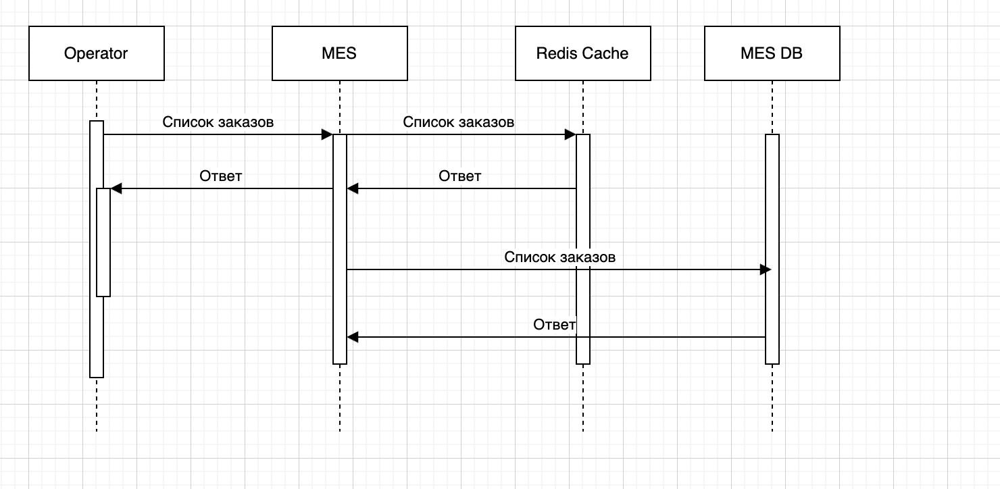
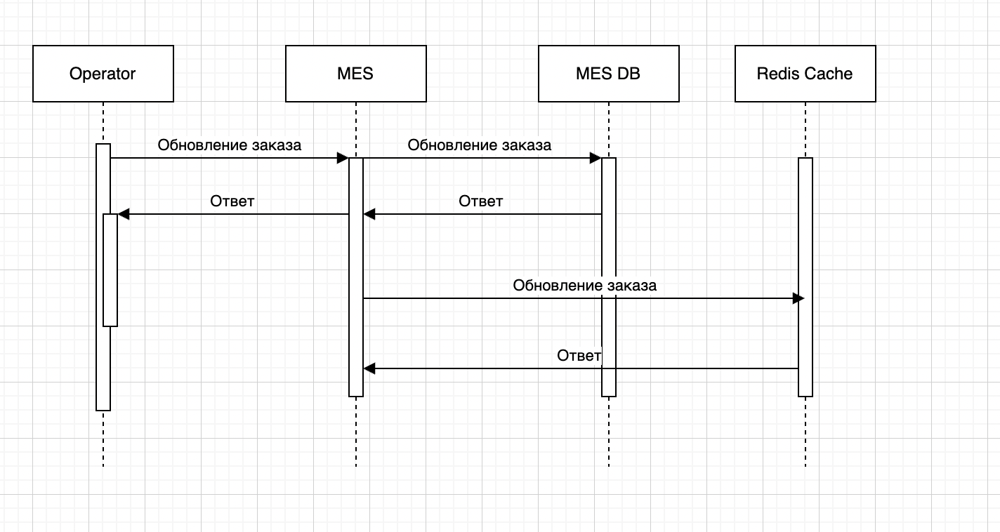

## Мотивация

На текущий момент операторы жалуются на:

долгую загрузку дашборда заказов в MES;

медленную работу первой страницы MES;

задержки при отображении статусов и списков заказов.

Основные причины:

каждый раз при загрузке MES делает тяжёлые запросы к базе;

большой объём заказов в статусах MANUFACTURING_STARTED, PACKAGING и т.д.;

частые обращения к одними и тем же данным без изменений.

## Предлагаемое решение

Что будем кешировать
1) Список заказов по статусам на главной странице MES;

2) Справочную информацию (материалы, операторы, SLA);

3) Историю заказов в CRM (архивные статусы).

## Тип кеша и паттерн
Серверное кеширование - так как:

клиентское не даёт прироста при сложных фильтрах;

сервер контролирует консистентность и TTL.

Паттерн: Cache-Aside (lazy-loading) — потому что:

прост в реализации;

не нагружает кеш данными, которые никто не запрашивает.

Почему не другие:

| Паттерн         | Плюсы                        | Минусы                         | Подходит |
|-----------------|-----------------------------|--------------------------------|----------|
| Cache-Aside     | Прост, гибкий, экономный     | Медленно при первом запросе    | ✅        |
| Write-Through   | Высокая консистентность      | Избыточная нагрузка на запись  | ❌        |
| Refresh-Ahead   | Нет задержек при чтении      | Перегрев кеша, сложность       | ❌        |

## Инвалидация кеша
Комбинированная стратегия:

TTL:

заказы: 30 секунд;

справочники: 1 час;

архивные данные: 24 часа.

Программная инвалидация:

по событию «обновление статуса заказа» (RabbitMQ pub/sub или Redis channels).

## Диаграмма последовательности
### Чтение списка заказов:

Вначале в кеше смотрим и если нет, то идем в БД

### Обновление статуса заказа:

Оператор → MES Frontend → MES Backend → MES DB
                                     → Redis: invalidate(key)
                                     → RabbitMQ: «order_updated»

## Технологии
Redis (Yandex Cloud);

Spring RedisTemplate (Java), StackExchange.Redis (.NET);

Redis pub/sub для сброса кеша.

## Компромиссы
Возможна разная версия данных в момент записи;

При пиковом росте заказов Redis тоже требует масштабирования.